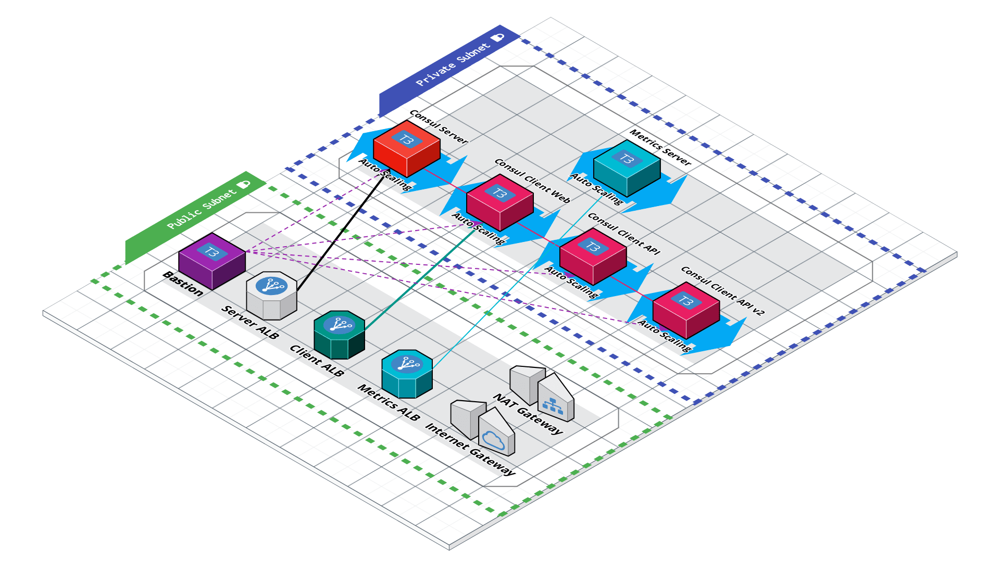

# Getting into Consul

This is the repo used in the [Getting into HashiCorp Consul](https://www.youtube.com/playlist?list=PL81sUbsFNc5b8i2g2sB_tG-PuZxEdlDpK) series where we walk through building out a Consul based architecture and cluster, on AWS, from scratch.

This repo is split into branches, each representing a part in the series:

- [Part 0 - Beginning of the Project](https://github.com/jcolemorrison/getting-into-consul/tree/part-0)
- [Part 1 - Configuring Server and Client on AWS](https://github.com/jcolemorrison/getting-into-consul/tree/part-1)
- [Part 2 - Configuring Service Discovery for Consul on AWS](https://github.com/jcolemorrison/getting-into-consul/tree/part-2)
- [Part 3 - Scaling, Outage Recovery, and Metrics for Consul on AWS](https://github.com/jcolemorrison/getting-into-consul/tree/part-3)
- [Part 4 - Security, Traffice Encryption, and ACLs](https://github.com/jcolemorrison/getting-into-consul/tree/part-4)
- [Part 5 - All About Access Control Lists (ACLs)](https://github.com/jcolemorrison/getting-into-consul/tree/part-5)
- [Part 6a - Configuring Consul with HCP Vault and Auto-Config](https://github.com/jcolemorrison/getting-into-consul/tree/part-6)
- [Part 6b - Mostly Manual Configuration for Part-7 and beyond (use this)](https://github.com/jcolemorrison/getting-into-consul/tree/part-6-manual)
- [Part 7 - Enabling Consul Service Mesh](https://github.com/jcolemorrison/getting-into-consul/tree/part-7)
- [Part 8 - Traffic Shaping and Envoy Debugging](https://github.com/jcolemorrison/getting-into-consul/tree/part-8)
- [Part 9 - Metrics with Prometheus](https://github.com/jcolemorrison/getting-into-consul/tree/part-9)
- [Part 10 - Terminating and Ingress Gateways](https://github.com/jcolemorrison/getting-into-consul/tree/part-10)
- [Part 11 - Mesh Federation](https://github.com/jcolemorrison/getting-into-consul/tree/part-11)
- [Part 12 - Using HCP Consul](https://github.com/jcolemorrison/getting-into-consul/tree/part-12)
	- uses [HashiCorp Cloud Platform (HCP) Consul](https://cloud.hashicorp.com/products/consul) instead of deploying Consul via Terraform 
- **[Master - The most up-to-date version of the repo](https://github.com/jcolemorrison/getting-into-consul)**

Note: for Parts 5 and beyond, the corresponding branch will include different resources, setup instructions, and scripts.  This is because we build out a foundation with Consul in the earlier parts, but after that, it's been exploration of different aspects of Consul which are not necessarily dependent upon each other.  The current master branch is the foundation state where only consul and two services are launched.

## The Architecture So Far:



## Getting Started

To set use this repo, take the following steps:

1. Have an AWS Account.

2. Ensure you have the following things installed locally:
	- [The AWS CLI](https://docs.aws.amazon.com/cli/latest/userguide/cli-chap-getting-started.html)
	- [Terraform](https://www.terraform.io/downloads.html)
	- [Consul](https://www.consul.io/downloads)
	- [jq](https://stedolan.github.io/jq/download/)

3. Either use the root user for your account, or create a new IAM user with either [Admin or PowerUser](https://docs.aws.amazon.com/IAM/latest/UserGuide/access_policies_job-functions.html#jf_developer-power-user) permissions.

4. Set up AWS credentials locally either through environment variables, through the AWS CLI, or directly in `~/.aws/credentials` and `~/.aws/config`.  [More information on authenticating with AWS for Terraform](https://registry.terraform.io/providers/hashicorp/aws/latest/docs#authentication).

5. Create an EC2 Keypair, download the key, and add the private key identity to the auth agent.  [More information on creating an EC2 Keypair](https://docs.aws.amazon.com/AWSEC2/latest/UserGuide/ec2-key-pairs.html).

	```sh
	# After downloading the key from AWS, on Mac for example
	chmod 400 ~/Downloads/your_aws_ec2_key.pem

	# Optionally move it to another directory
	mv ~/Downloads/your_aws_ec2_key.pem ~/.ssh/

	# Add the key to your auth agent
	ssh-add -k ~/.ssh/your_aws_ec2_key.pem
	```

6. Create a `terraform.tfvars` file and add the name of your key for the `ec2_key_pair_name` variable:

	```
	ec2_key_pair_name = "your_aws_ec2_key"
	```

7. Run `terraform apply`!

8. After the apply is complete, run the post apply script:
	```sh
	# this will output two things:

	# 1. Sensitive values needed in a local file 'tokens.txt'

	# 2. Values required by the metrics_module

	# 3. Detailed setup instructions which are also listed below
	bash scripts/post-apply.sh
	```

9. SSH into `bastion` and then into your `getting-into-consul-api` nodes...
	1. Add the `client_api_node_id_token` from `tokens.txt` to the `/etc/consul.d/consul.hcl` file in the acl.tokens block.
	2. Add the `client_api_service_token` from `tokens.txt` to the `/etc/consul.d/api.hcl` file in the service.token block.
	3. Add the `client_api_service_token` from `tokens.txt` to the `/etc/systemd/system/consul-envoy.service`.
	4. Restart both `consul`, `api`, and `consul-envoy` service:
       ```sh
       sudo systemctl daemon-reload
       sudo systemctl restart consul api consul-envoy
       ```
	> NOTE: Sometimes `consul-envoy` will fail to start if `consul` isn't given enough time to start up.  Simply restart `consul-envoy` again if this is the case.

10. SSH into `bastion` and then into your `getting-into-consul-web` nodes...
	1. Add the `client_web_node_id_token` from `tokens.txt` to the `/etc/consul.d/consul.hcl` file in the acl.tokens block.
	2. Add the `client_web_service_token` from `tokens.txt` to the `/etc/consul.d/web.hcl` file in the service.token block.
	3. Add the `client_web_service_token` from `tokens.txt` to the `/etc/systemd/system/consul-envoy.service`.
	4. Restart both `consul`, `web`, and `consul-envoy` service:
		```sh
       sudo systemctl daemon-reload
       sudo systemctl restart consul web consul-envoy
		```
	> NOTE: Sometimes `consul-envoy` will fail to start if `consul` isn't given enough time to start up.  Simply restart `consul-envoy` again if this is the case.

11. Head to the Consul UI via your `consul_server` output from Terraform (the `application load balancer` DNS for the server).
	1. Login with your root token (the `consul_token` output, you can find it in your state file)

12. To verify everything is working, check out your Consul UI...
	- All services in the **Services** tab should be green.
	- All nodes in the **Nodes** tab should be green.

13. To verify the web service is up and running, head to the DNS printed in the terraform output as `web_server`
	- It should show the upstream `body` of the `api` server with an IP address in `dc1`.

### Deploy the Optional Metrics Server

There's also another module nested in this repository that will stand up a [prometheus](https://prometheus.io/) deployment to monitor your Consul cluster.  To deploy it.

1. Ensure that the above "Getting Started" instructions have been followed. 
	- including running the `post-apply.sh` script that creates needed variables for the metrics deployment.

2. Run the `post-apply-metrics.sh` script:

	```
	bash scripts/post-apply-metrics.sh
	```

3. Navigate to the nested `metrics_module`.

	```
	cd metrics_module/
	```

4. Initialize the nested Terraform Module:

	```
	terraform init
	```

5. Deploy it:

	```
	terraform apply
	```

6. Afterwards, it'll output `metrics_endpoint` which is the endpoint you can visit to view your metrics.

### Setting Things Up Manually

Although this repo is set up so that you can get everything working via `terraform apply`, if you'd like to take the manual steps for learning, you can reference these documents:

1. [From Part 1 to Part 2 Manual Steps](part-2-manual-steps.md)
2. [From Part 2 to Part 3 Manual Steps](part-3-manual-steps.md)
3. [From Part 3 to Part 4 Manual Steps](part-4-manual-steps.md)
4. [From Part 4 to Part 5 Manual Steps](part-5-manual-steps.md)
5. Follow the Steps on this README to get to Part 6
6. [From Part 6 to Part 7 Manual Steps](part-7-manual-steps.md)
7. [From Part 7 to Part 8 Manual Steps](part-8-manual-steps.md)
8. [From Part 8 to Part 9 Manual Steps](part-9-manual-steps.md)
	- Checkout the [part-9-manual branch](https://github.com/jcolemorrison/getting-into-consul/tree/part-9-manual) to follow these.
9. [From Part 9 to Part 10 Manual Steps](part-10-manual-steps.md)
10. [From Part 11 to Part 12 Manual Steps](part-12-manual-steps.md)

For example, if you wanted to manually learn Part 1 to Part 2, begin on the [Part 1 Branch](https://github.com/jcolemorrison/getting-into-consul/tree/part-1), and follow the "[From Part 1 to Part 2 Manual Steps](part-2-manual-steps.md)".

## Troubleshooting

#### `502 Bad Gateway Error` when visiting the Consul Server UI

The most likely cause of this is a failure to fetch and install consul on the servers due to a failure to get the required GPG key.  The most straightforward way to fix this is to `terraform destroy` the infrastructure and reapply it via `terraform apply`.

#### `web` service fails to reach the `api` service

If everything deployed fine and you can see the Consul UI and the `web` service is reachable but is saying that the `api` can't be reached, it's likely Consul Intentions.  To fix:

1. Login with your consul bootstrap token.
2. Click the **Web** service and then click on the **Topology** tab.
3. Click on the red arrow between the **web** and the **api** boxes and click **Create** to create a new intention that allows the `web` to access the `api` service.

## Notes

- [Cloud Auto-Join](https://www.consul.io/docs/install/cloud-auto-join) is set up for part 1, despite not being in the stream itself.
