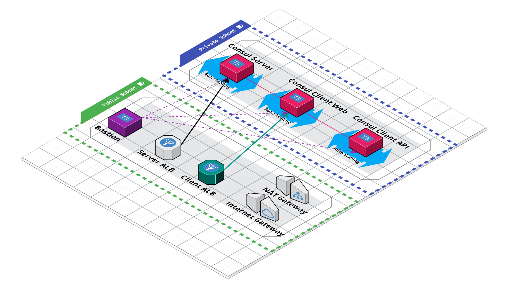

# Getting into Consul

This is the repo used in the [Getting into HashiCorp Consul](https://www.youtube.com/playlist?list=PL81sUbsFNc5b8i2g2sB_tG-PuZxEdlDpK) series where we walk through building out a Consul based architecture and cluster, on AWS, from scratch.

This repo is split into branches, each representing a part in the series:

- [Part 0 - Beginning of the Project](https://github.com/jcolemorrison/getting-into-consul/tree/part-0)
- [Part 1 - Configuring Server and Client on AWS](https://github.com/jcolemorrison/getting-into-consul/tree/part-1)
- [Part 2 - Configuring Service Discovery for Consul on AWS](https://github.com/jcolemorrison/getting-into-consul/tree/part-2)
- [Part 3 - Scaling, Outage Recovery, and Metrics for Consul on AWS](https://github.com/jcolemorrison/getting-into-consul/tree/part-3)
- [Part 4 - Security, Traffice Encryption, and ACLs](https://github.com/jcolemorrison/getting-into-consul/tree/part-4)
- [Part 5 - All About Access Control Lists (ACLs)](https://github.com/jcolemorrison/getting-into-consul/tree/part-5)
- [Part 6a - Configuring Consul with HCP Vault and Auto-Config](https://github.com/jcolemorrison/getting-into-consul/tree/part-6)
- [Part 6b - Mostly Manual Configuration for Part-7 and beyond (use this)](https://github.com/jcolemorrison/getting-into-consul/tree/part-6-manual)
- **[Master - The most up-to-date version of the repo](https://github.com/jcolemorrison/getting-into-consul)**

## The Architecture So Far:



## Getting Started

To set use this repo, take the following steps:

1. Have an AWS Account.

2. Ensure you have the following things installed locally:
	- [The AWS CLI](https://docs.aws.amazon.com/cli/latest/userguide/cli-chap-getting-started.html)
	- [Terraform](https://www.terraform.io/downloads.html)
	- [Consul](https://www.consul.io/downloads)
	- [jq](https://stedolan.github.io/jq/download/)

3. Either use the root user for your account, or create a new IAM user with either [Admin or PowerUser](https://docs.aws.amazon.com/IAM/latest/UserGuide/access_policies_job-functions.html#jf_developer-power-user) permissions.

4. Set up AWS credentials locally either through environment variables, through the AWS CLI, or directly in `~/.aws/credentials` and `~/.aws/config`.  [More information on authenticating with AWS for Terraform](https://registry.terraform.io/providers/hashicorp/aws/latest/docs#authentication).

5. Create an EC2 Keypair, download the key, and add the private key identity to the auth agent.  [More information on creating an EC2 Keypair](https://docs.aws.amazon.com/AWSEC2/latest/UserGuide/ec2-key-pairs.html).

	```sh
	# After downloading the key from AWS, on Mac for example
	chmod 400 ~/Downloads/your_aws_ec2_key.pem
	
	# Optionally move it to another directory
	mv ~/Downloads/your_aws_ec2_key.pem ~/.ssh/

	# Add the key to your auth agent
	ssh-add -k ~/.ssh/your_aws_ec2_key.pem
	```

6. Create a `terraform.tfvars` file and add the name of your key for the `ec2_key_pair_name` variable:

	```
	ec2_key_pair_name = "your_aws_ec2_key"
	```

7. Run `terraform apply`!

8. After the apply is complete, run the post apply script:

	```sh
	# this will output sensitive values needed in a local file 'tokens.txt'
	bash scripts/post-apply.sh
	```

9. SSH into your Bastion and then into your `getting-into-consul-api` nodes...
	1. Add the `client_api_node_id_token` from `tokens.txt` to the `/etc/consul.d/consul.hcl` file in the acl.tokens block.
	2. Add the `client_api_service_token` from `tokens.txt` to the `/etc/consul.d/api.hcl` file in the service.token block.
	3. Restart both `consul` and the `api` service:
		```sh
		sudo systemctl restart consul
		sudo systemctl restart api
		```

10. SSH into your Bastion and then into your `getting-into-consul-web` nodes...
	1. Add the `client_web_node_id_token` from `tokens.txt` to the `/etc/consul.d/consul.hcl` file in the acl.tokens block.
	2. Add the `client_web_service_token` from `tokens.txt` to the `/etc/consul.d/web.hcl` file in the service.token block.
	3. Restart both `consul` and the `web` service:
		```sh
		sudo systemctl restart consul
		sudo systemctl restart web
		```

11. (Optional) Create the `allow-dns` policy and attach it to the Node Identity tokens for the `api` and `web` nodes:
	0. (These steps are optional because the rules in the allow-dns policy are now included in the default ACL attached to the node identity token)
	1. Access the consul console by heading to your application load balancer's DNS printed in the terraform outputs as `consul_server`
	2. Go to **Policies** and click **Create**.
	3. For **Name** enter "allow-dns" and paste the contents of `./policies/allow-dns.hcl` into the **Rules** field.
	4. Click **Save**.
	5. Click on **Tokens**.
	6. For each token with the label like `Serivce Identity: ip-*-*-*-*`, click into it.
	7. Click the dropdown under **Policies** and select our `allow-dns` policy we created.
	8. Click **Save**.
	9. Repeat for all other tokens with the label like `Serivce Identity: ip-*-*-*-*`

12. To verify everything is working, check out your Consul UI...
	- All services in the **Services** tab should be green.
	- All nodes in the **Nodes** tab should be green.

13. To verify the web service is up and running, head to the DNS printed in the terraform output as `web_server`
	- It shouldn't have any errors

### Setting Things Up Manually

Although this repo is set up so that you can get everything working via `terraform apply`, if you'd like to take the manual steps for learning, you can reference these documents:

1. [From Part 1 to Part 2 Manual Steps](part-2-manual-steps.md)
2. [From Part 2 to Part 3 Manual Steps](part-3-manual-steps.md)
3. [From Part 3 to Part 4 Manual Steps](part-4-manual-steps.md)
4. [From Part 4 to Part 5 Manual Steps](part-4-manual-steps.md)

For example, if you wanted to manually learn Part 1 to Part 2, begin on the [Part 1 Branch](https://github.com/jcolemorrison/getting-into-consul/tree/part-1), and follow the "[From Part 1 to Part 2 Manual Steps](part-2-manual-steps.md)".

### Notes

- [Cloud Auto-Join](https://www.consul.io/docs/install/cloud-auto-join) is set up for part 1, despite not being in the stream itself.
