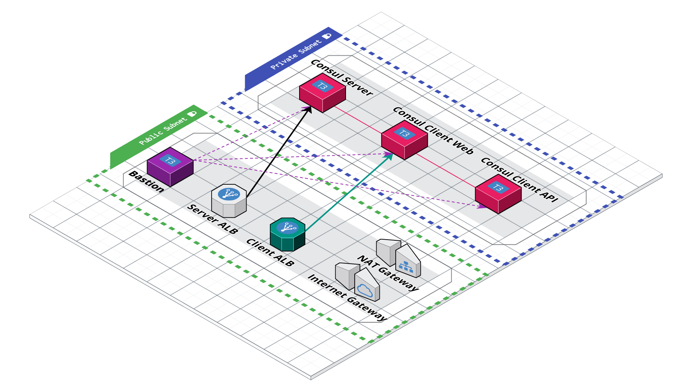

# Getting into Consul

This is the repo used in the [Getting into Consul](https://youtu.be/0H06VKvlTJQ) series where we walk through building out a consul based architecture and cluster from scratch.

This repo is split into branches, each representing a part in the series:

- [Part 0 - Beginning of the Project](https://github.com/jcolemorrison/getting-into-consul/tree/part-0)
- [Part 1 - Configuring Server and Client on AWS](https://github.com/jcolemorrison/getting-into-consul/tree/part-1)
- **[Part 2 - Configuring Service Discovery for Consul on AWS](https://github.com/jcolemorrison/getting-into-consul/tree/part-2)**
- [Part 3 - Scaling, Outage Recovery, and Metrics for Consul on AWS](https://github.com/jcolemorrison/getting-into-consul/tree/part-3)
- [Part 4 - Security, Traffice Encryption, and ACLs](https://github.com/jcolemorrison/getting-into-consul/tree/part-4)
- [Part 5 - All About Access Control Lists (ACLs)](https://github.com/jcolemorrison/getting-into-consul/tree/part-5)
- [Part 6a - Configuring Consul with HCP Vault and Auto-Config](https://github.com/jcolemorrison/getting-into-consul/tree/part-6)
- [Part 6b - Mostly Manual Configuration for Part-7 and beyond (use this)](https://github.com/jcolemorrison/getting-into-consul/tree/part-6-manual)
- [Master - The most up-to-date version of the repo](https://github.com/jcolemorrison/getting-into-consul)

## The Initial Architecture:



## Getting Started

To set use this repo, take the following steps:

1. Have an AWS Account.

2. Either use the root user for your account, or create a new IAM user with either [Admin or PowerUser](https://docs.aws.amazon.com/IAM/latest/UserGuide/access_policies_job-functions.html#jf_developer-power-user) permissions.

3. Set up AWS credentials locally either through environment variables, through the AWS CLI, or directly in `~/.aws/credentials` and `~/.aws/config`.  [More information on authenticating with AWS for Terraform](https://registry.terraform.io/providers/hashicorp/aws/latest/docs#authentication).

4. Create an EC2 Keypair, download the key, and add the private key identity to the auth agent.  [More information on creating an EC2 Keypair](https://docs.aws.amazon.com/AWSEC2/latest/UserGuide/ec2-key-pairs.html).

		```sh
		# After downloading the key from AWS, on Mac for example
		chmod 400 ~/Downloads/your_aws_ec2_key.pem
		
		# Optionally move it to another directory
		mv ~/Downloads/your_aws_ec2_key.pem ~/.ssh/

		# Add the key to your auth agent
		ssh-add -k ~/.ssh/your_aws_ec2_key.pem
		```

5. Create a `terraform.tfvars` file and add the name of your key for the `ec2_key_pair_name` variable:

		```
		ec2_key_pair_name = "your_aws_ec2_key"
		```

6. Run `terraform apply`!

7. To check out your Consul UI...

	- Go to the **EC2 Console**.
	- Select **Load Balancers**.
	- Select the load balancer created for our project, and grab its DNS.
	- Navigate to the DNS.

### Notes

- [Cloud Auto-Join](https://www.consul.io/docs/install/cloud-auto-join) is set up for part 1, despite not being in the stream itself.